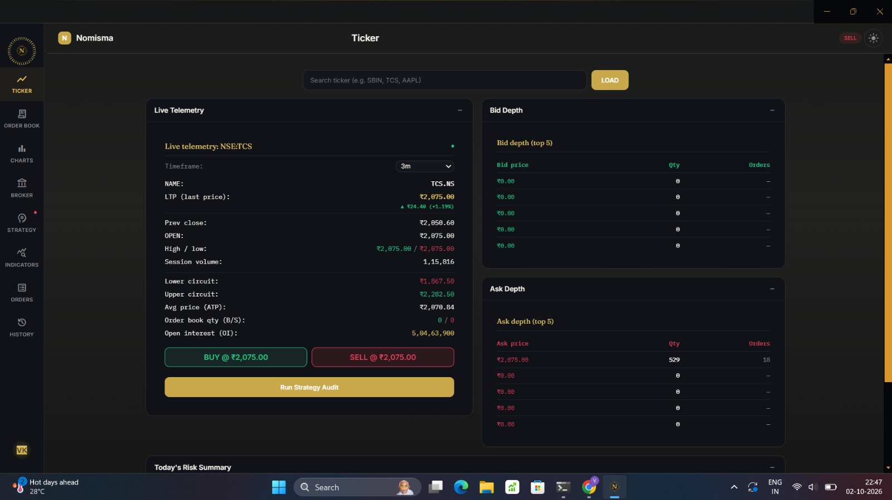
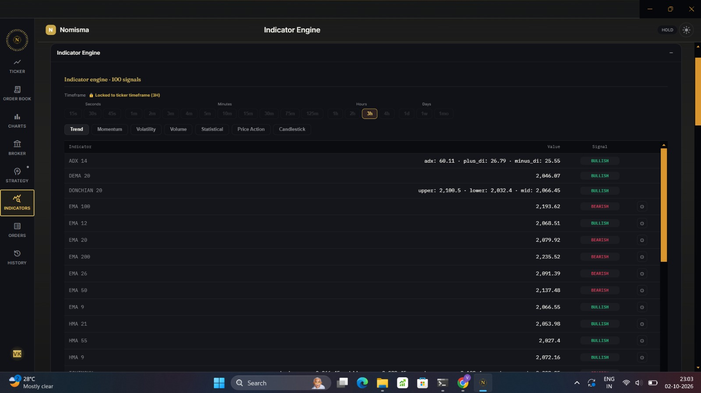
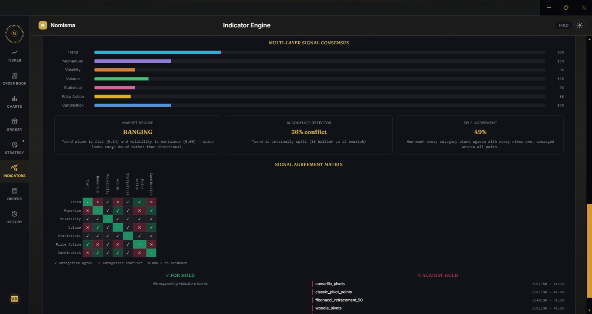
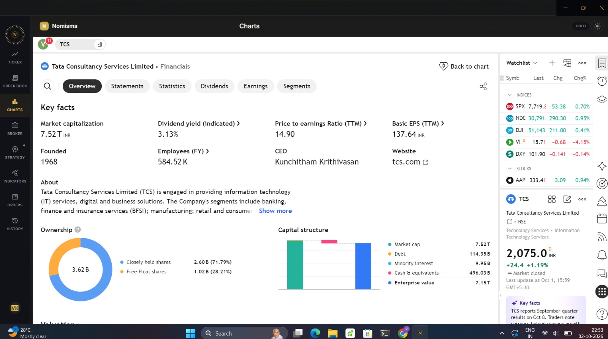
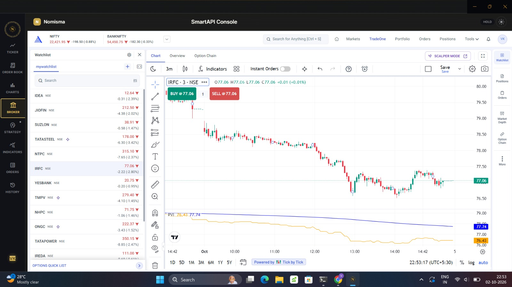
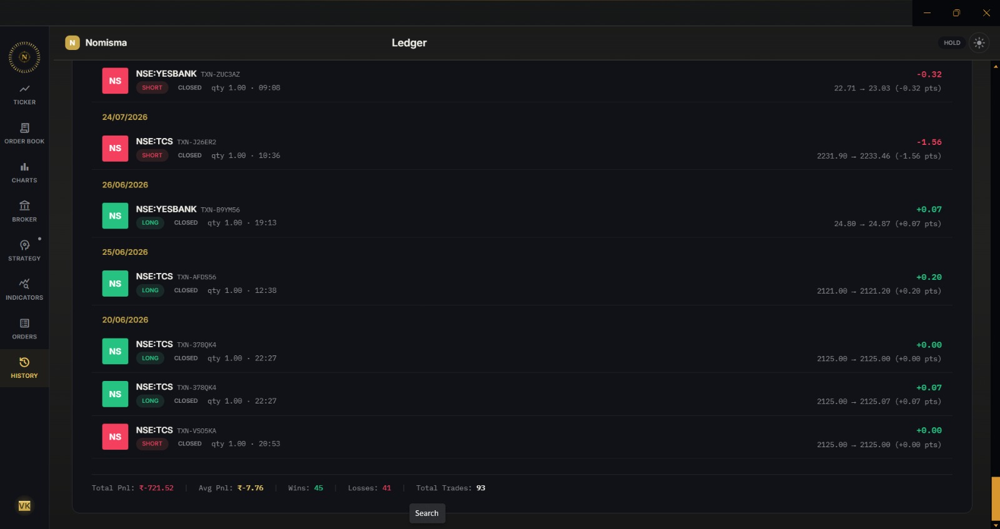

<div align="center">

# Thrice Nomisma

**A Bloomberg-style desktop trading terminal for Indian equities (NSE/BSE)**

Live tick-by-tick data · 100-indicator signal engine · Multi-timeframe strategies · Explainable signal consensus


<br>



</div>

---

## Table of contents

- [Overview](#overview)
- [Screenshots](#screenshots)
- [Features](#features)
- [Tech stack](#tech-stack)
- [Architecture notes](#architecture-notes)
- [Getting started](#getting-started)
- [Known issues](#known-issues)
- [Roadmap](#roadmap)
- [Authors](#authors)

## Overview

Thrice Nomisma brings the depth of a professional trading terminal to Indian markets: real-time data over authenticated sessions, a large indicator library, multi-timeframe strategy signals, and a custom dark UI built for fast, focused reading of market state.

Instead of showing a wall of indicators and leaving interpretation to you, the terminal measures how much the indicators **agree or conflict**, detects the **market regime**, and explains what that means for the current signal.

## Screenshots

### Live ticker: telemetry and order-book depth

Per-symbol live telemetry (LTP, previous close, day high/low, session volume, circuit limits, ATP, open interest) alongside top-5 bid and ask depth, with one-click Buy/Sell and a **Run Strategy Audit** action. A risk summary sits below.


### Indicator engine: 100 signals across 7 categories

Browse indicators by category (Trend, Momentum, Volatility, Volume, Statistical, Price Action, Candlestick). Each row shows its computed value and a Bullish/Bearish signal. The timeframe selector spans 15 seconds to 1 month and locks to the active ticker timeframe.



### Signal intelligence: consensus, regime and conflict

A multi-layer consensus view per category, plus **Market Regime** detection, an **AI Conflict Detector**, a **Self-Agreement** score, and a pairwise **Signal Agreement Matrix** showing which categories confirm or contradict each other. Indicators are split into those supporting and those arguing against the current stance.



### Integrated charting and fundamentals

Charting with a TradingView-style layer, and a financials view with key facts, ownership and capital structure for the selected symbol.



### Broker workspace

Broker console with watchlist, live chart, scalper mode and an indicator overlay, all inside the terminal window.



### Trade history ledger

A ledger of closed trades grouped by date, with side, entry/exit, point P&L, and running totals for P&L, average P&L, wins, losses and trade count.



## Features

### Market data
- Live tick-by-tick price feeds and order-book data over secure, authenticated sessions
- Broad symbol support for NSE/BSE equities

### Indicator & signal engine
- ~100-indicator engine spanning 7 categories, each with configurable parameters
- Institutional-grade additions: order flow pressure, signed ADX, RSI divergence, Stochastic RSI, CCI, Williams %R, OBV, Aroon, Ultimate Oscillator, Choppiness Index, Keltner squeeze, rolling Z-score
- Multi-timeframe strategy engine (1-minute through monthly) across 11 strategy modules, from scalping to monthly horizons
- Quantitative factor engine covering trend, momentum, volatility, and volume/flow signals
- Signal-quality scoring and a signal arbitration layer with regime-aware confidence discounting

### Signal intelligence
- Market regime detection
- Signal consensus bars and a conflict detector
- Category heatmap and agreement matrix for at-a-glance indicator agreement
- Timeframe consensus strip
- AI explainability for signals, powered by a local reasoning engine (no external LLM API dependency)
- FinBERT-based sentiment engine with in-memory caching and headline fallback

### Visualization
- 3D indicator waveform (Three.js) with per-category color palettes, click-to-pin tooltips, and legend-based category isolation
- Integrated charting and technical-analysis layer
- Plane-overlap analysis view backed by a Python engine using Wilson confidence intervals and Shannon entropy

### Risk management
- Shared risk-management utilities across strategies
- Hardened risk engine with an F-grade hard block for high-risk conditions

### Design
- Custom void-black theme aimed at Bloomberg/cursor.com-level polish
- JetBrains Mono for data, Space Grotesk for headers, amber accents, sharp corner radii, and dedicated motion tokens
- Accessibility fixes throughout
- Landing page as a proper welcome screen ahead of the trading portal
- Consistent Electron window chrome theming (popup windows, title bar overlay, scrollbar, nav transparency)

## Accuracy

The signal engine achieved **78% accuracy** in our evaluation.

| | |
| --- | --- |
| **What is measured** | `<e.g. directional accuracy: how often the predicted direction matched the actual next move>` |
| **Dataset** | `<symbols, e.g. NSE large caps>` |
| **Period** | `<date range tested>` |
| **Timeframe** | `<e.g. 3m / 1h / 1d>` |
| **Sample size** | `<number of signals evaluated>` |

> **Note:** This is a historical evaluation result and not a guarantee of future performance. This project is not financial advice.

## Tech stack

| Layer | Technologies |
| --- | --- |
| Frontend | Electron, React, TypeScript |
| Backend | Python, FastAPI |
| Data / analysis | NaN/Inf-safe JSON serialization for indicator output, Wilson confidence intervals, Shannon entropy |
| 3D / visualization | Three.js |
| NLP | FinBERT (sentiment) |

## Architecture notes

- Backend indicator and strategy logic lives primarily in `strategy_utils.py` and the risk engine (`risk.py`)
- Frontend and backend communicate over authenticated sessions for live data
- Started as a React + FastAPI + yfinance capstone project (Phase 1, ~June 2025), including early TradingView widget embedding and a TradingView-style dark theme, before evolving into the current Electron-based terminal

## Getting started

```bash
# Clone the repository
git clone <repo-url>
cd thrice-nomisma

# Install frontend dependencies
npm install

# Install backend dependencies
cd backend
pip install -r requirements.txt
cd ..

# Run the backend
uvicorn main:app --reload

# Run the Electron app
npm start
```

## Known issues

- Actively debugging an Electron blank-screen issue tied to the `package.json` `main` field

## Roadmap

- [ ] Resolve Electron blank-screen bug
- [ ] Expand strategy module coverage
- [ ] Broaden backtesting support
- [ ] Production-hardening for live trading use

## Authors

**Pushkar Kumar** · **Mrigank Rautela** · **Vinayak Uttam Killedar**
